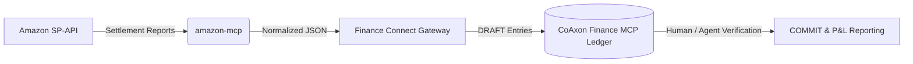

# CoAxon Finance Connect (Amazon SP-API to Ledger Gateway)

This directory contains configuration templates and integration schemas for connecting `amazon-mcp` to the **CoAxon Finance MCP** (Private Beta).

---

## What is Finance Connect?

While `amazon-mcp` handles operational read/writes against Amazon SP-API (orders, inventory, pricing, ads), **Finance Connect** is the bridge that feeds financial settlement data directly into your immutable general ledger.

Instead of manually exporting CSV settlement reports and importing them into complex accounting software (NetSuite, QuickBooks), Finance Connect establishes a seamless, automated pipeline:



### Key Capabilities

1. **Automated Settlement Mapping**: Automatically maps Amazon disbursements, FBA fulfillment fees, advertising spend, storage fees, and refunds to standardized accounting codes (e.g., Chinese GAAP or US GAAP).
2. **Strict "Draft-First" Safety**: All incoming Amazon settlement data arrives in your ledger as `DRAFT` status. No transaction is ever committed to your core financial statements without human review or secondary agent verification.
3. **Zero Redundancy**: Built-in idempotency checks ensure that overlapping settlement reports or re-triggered DAG workflows never create duplicate accounting entries.
4. **Multi-Tenant Isolation**: Designed for sellers managing multiple storefronts or marketplaces, keeping each brand's ledger perfectly isolated and secure.

---

## Quick Start (Private Beta)

The core **CoAxon Finance MCP** engine is maintained as a closed-source, enterprise-grade managed service due to strict financial compliance and audit trail requirements.

To configure your local `amazon-mcp` instance to push settlement events to your Finance MCP tenant:

1. Copy the example configuration:
   ```bash
   cp tenant_config.example.json tenant_config.json
   ```
2. Populate `tenant_id`, `gateway_url`, and your `hmac_secret` provided during your Private Beta onboarding.
3. Enable the sync trigger in your environment:
   ```bash
   export AMAZON_MCP_FINANCE_SYNC=1
   export AMAZON_MCP_FINANCE_CONFIG=./finance-connect/tenant_config.json
   ```

---

## Requesting Private Beta Access

We are currently onboarding a limited number of multi-platform sellers and early-stage teams to the **CoAxon Finance MCP Private Beta**.

If you want to eliminate end-of-month accounting chaos and build an automated operations-to-finance pipeline, reach out to us at:
📧 **[info@coaxon.me](mailto:info@coaxon.me)**

*Please include your current storefront volume, primary marketplaces, and existing accounting stack in your inquiry.*
